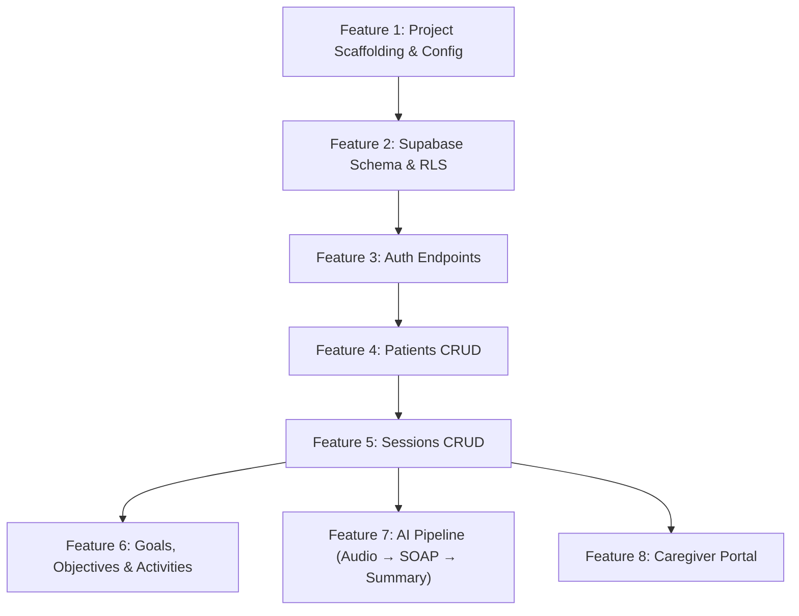
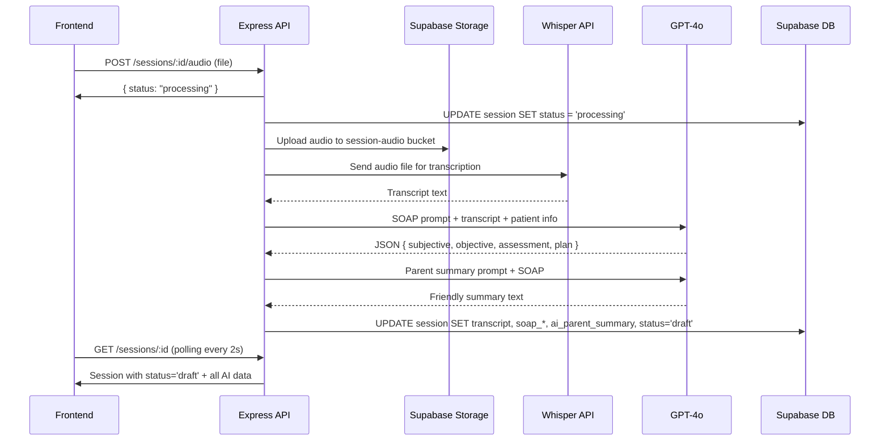

# 07 — Feature-by-Feature Backend Implementation Plan

> **Purpose:** This document breaks the entire TalkAlign Express.js backend into **8 sequential features**. Each feature is self-contained, testable, and builds on the previous one. Implement them in order.

---

## Overview & Dependency Graph



---

## Feature 1 — Project Scaffolding & Configuration

### Goal
Set up the Express.js + TypeScript project with environment validation, Supabase client helpers, shared middleware, and error handling — so that every subsequent feature just plugs in routes.

### Files to Create

```text
backend/
├── package.json
├── tsconfig.json
├── .env                          # (gitignored, template provided)
├── .env.example                  # Committed template
├── .gitignore
├── src/
│   ├── index.ts                  # Express app bootstrap & server startup
│   ├── config/
│   │   ├── env.ts                # Zod schema validating process.env
│   │   └── supabase.ts           # Supabase client helpers
│   ├── middleware/
│   │   ├── auth.ts               # JWT extraction & validation middleware
│   │   ├── validate.ts           # Generic Zod request validation middleware
│   │   └── errorHandler.ts       # Global Express error handler
│   ├── lib/
│   │   └── apiResponse.ts        # { success, data } / { success, error } helpers
│   ├── routes/                   # (empty, ready for features)
│   ├── controllers/              # (empty)
│   ├── services/                 # (empty)
│   └── schemas/                  # (empty)
```

### Implementation Details

#### 1.1 — `package.json`
```json
{
  "name": "talkalign-backend",
  "version": "1.0.0",
  "private": true,
  "scripts": {
    "dev": "tsx watch src/index.ts",
    "build": "tsc",
    "start": "node dist/index.js"
  }
}
```
**Dependencies:**
- `express`, `cors`, `helmet`, `morgan` — HTTP framework & security
- `@supabase/supabase-js` — Supabase client
- `zod` — Request / env validation
- `multer` — File uploads (needed in Feature 7)
- `openai` — AI SDK (needed in Feature 7)
- `dotenv` — Load `.env`

**Dev Dependencies:**
- `typescript`, `tsx`, `@types/express`, `@types/cors`, `@types/multer`, `@types/morgan`

#### 1.2 — `src/config/env.ts`
Use Zod to validate required environment variables at startup:
```typescript
// Required env vars:
// PORT (default 3001)
// FRONTEND_URL (default http://localhost:5173)
// SUPABASE_URL
// SUPABASE_ANON_KEY
// SUPABASE_SERVICE_ROLE_KEY
// OPENAI_API_KEY
```
If any are missing, the server should **crash immediately** with a clear error message.

#### 1.3 — `src/config/supabase.ts`
Two client factory functions:

| Function | Purpose | Auth |
|----------|---------|------|
| `createUserClient(token: string)` | Scoped to the user's JWT — respects RLS | Uses `SUPABASE_ANON_KEY` + `Authorization: Bearer <token>` |
| `createAdminClient()` | Bypasses RLS — used only by the AI pipeline worker | Uses `SUPABASE_SERVICE_ROLE_KEY` |

> **Security Note (from Supabase Skill):** Never expose the service role key to the frontend. The admin client must only be used server-side for background AI processing.

#### 1.4 — `src/middleware/auth.ts`
1. Extract `Authorization: Bearer <token>` from the request header.
2. Call `supabase.auth.getUser(token)` to validate the JWT and retrieve the user.
3. Attach the user object to `req.user`.
4. If token is invalid or missing → respond with `401`.

Also create a **role-guard factory**:
```typescript
export const requireRole = (...roles: string[]) => (req, res, next) => {
  // Check req.user.role against allowed roles
};
```

#### 1.5 — `src/middleware/validate.ts`
A generic middleware factory that validates `req.body`, `req.query`, or `req.params` against a Zod schema:
```typescript
export const validate = (schema: ZodSchema, source: 'body' | 'query' | 'params') => ...
```

#### 1.6 — `src/middleware/errorHandler.ts`
Global error handler returning the standard JSON error format:
```json
{ "success": false, "error": { "message": "..." } }
```

#### 1.7 — `src/index.ts`
- Load env vars via `dotenv` + validate with `env.ts`
- Apply `cors({ origin: FRONTEND_URL, credentials: true })`, `helmet()`, `morgan('dev')`, `express.json()`
- Mount route groups under `/api/v1/...`
- Apply global error handler last
- Listen on `PORT`

### Acceptance Criteria
- [ ] `npm run dev` starts the server on port 3001 without errors
- [ ] `GET /` returns `{ "status": "ok" }` (health check)
- [ ] Missing env vars crash the server with a descriptive message
- [ ] Requests without a valid JWT to protected routes return `401`

---

## Feature 2 — Supabase Database Schema & RLS

### Goal
Create all database tables, types, triggers, and RLS policies in Supabase so the data layer is ready for the API.

### SQL Migrations to Execute (via Supabase Dashboard SQL Editor or CLI)

#### 2.1 — Custom Types
```sql
CREATE TYPE user_role AS ENUM ('doctor', 'parent');
CREATE TYPE patient_status AS ENUM ('active', 'inactive', 'discharged');
CREATE TYPE session_status AS ENUM ('scheduled', 'in_progress', 'processing', 'draft', 'completed');
CREATE TYPE goal_type AS ENUM ('long_term', 'short_term');
CREATE TYPE goal_status AS ENUM ('not_started', 'in_progress', 'achieved');
CREATE TYPE difficulty_level AS ENUM ('Easy', 'Medium', 'Hard');
```

#### 2.2 — Tables (in dependency order)
1. **`profiles`** — extends `auth.users`
2. **`patients`** — FK to profiles (doctor_id, caregiver_id)
3. **`sessions`** — FK to patients, profiles
4. **`home_practice_tasks`** — FK to sessions
5. **`goals`** — FK to patients
6. **`objectives`** — FK to goals
7. **`activities`** — FK to goals

> Refer to [03_Database_Schema.md](./03_Database_Schema.md) for exact column definitions.

#### 2.3 — Auto-Profile Trigger
```sql
CREATE OR REPLACE FUNCTION public.handle_new_user()
RETURNS trigger AS $$
BEGIN
  INSERT INTO public.profiles (id, name, email, role)
  VALUES (
    new.id,
    new.raw_user_meta_data->>'name',
    new.email,
    (new.raw_user_meta_data->>'role')::user_role
  );
  RETURN new;
END;
$$ LANGUAGE plpgsql SECURITY DEFINER;

CREATE TRIGGER on_auth_user_created
  AFTER INSERT ON auth.users
  FOR EACH ROW EXECUTE PROCEDURE public.handle_new_user();
```

> **Security Note (from Supabase Skill):** This function is `SECURITY DEFINER`. Keep it in the `public` schema only if necessary — ideally move to a private schema. Never use `raw_user_meta_data` for authorization decisions beyond this initial profile seeding — store authoritative role data in the `profiles` table.

#### 2.4 — RLS Policies

| Table | Role | Operations | Policy Condition |
|-------|------|------------|-----------------|
| `profiles` | Any authenticated | `SELECT` own | `id = auth.uid()` |
| `patients` | Doctor | `SELECT, INSERT, UPDATE` | `doctor_id = auth.uid()` |
| `patients` | Parent | `SELECT` | `caregiver_id = auth.uid()` |
| `sessions` | Doctor | `SELECT, INSERT, UPDATE` | `therapist_id = auth.uid()` |
| `sessions` | Parent | `SELECT` | `patient_id IN (SELECT id FROM patients WHERE caregiver_id = auth.uid())` |
| `home_practice_tasks` | Doctor | `SELECT, INSERT, UPDATE` | via join to sessions → `therapist_id = auth.uid()` |
| `home_practice_tasks` | Parent | `SELECT, UPDATE (completed only)` | via join to sessions → patients → `caregiver_id = auth.uid()` |
| `goals` | Doctor | `SELECT, INSERT, UPDATE` | via join to patients → `doctor_id = auth.uid()` |
| `goals` | Parent | `SELECT` | via join to patients → `caregiver_id = auth.uid()` |
| `objectives` | Doctor | `SELECT, INSERT, UPDATE` | via join to goals → patients → `doctor_id = auth.uid()` |
| `activities` | Doctor | `SELECT, INSERT, UPDATE` | via join to goals → patients → `doctor_id = auth.uid()` |

#### 2.5 — Storage Bucket
```sql
-- Create via Supabase Dashboard or API:
-- Bucket name: session-audio
-- Public: false
-- RLS: INSERT restricted to doctor role, SELECT via service role
```

### Acceptance Criteria
- [ ] All 7 tables exist with correct columns and constraints
- [ ] `handle_new_user` trigger fires on signup and creates a profile row
- [ ] A doctor can only query their own patients via RLS
- [ ] A parent can only query patients where they are the caregiver
- [ ] Storage bucket `session-audio` exists and is private

---

## Feature 3 — Authentication Endpoints

### Goal
Implement login, register, and logout by proxying to Supabase Auth, so the frontend never talks directly to Supabase.

### Files to Create/Modify

| File | Purpose |
|------|---------|
| `src/schemas/auth.schema.ts` | Zod schemas for login & register request bodies |
| `src/controllers/auth.controller.ts` | Handler functions |
| `src/routes/auth.routes.ts` | Route definitions |
| `src/index.ts` | Mount auth routes |

### Endpoints

#### `POST /api/v1/auth/register`
**Request Body:**
```json
{
  "name": "Dr. Aisha Nair",
  "email": "doctor@talkalign.com",
  "password": "password123",
  "role": "doctor"
}
```
**Logic:**
1. Validate body with Zod (`name`, `email`, `password`, `role` ∈ `['doctor','parent']`)
2. Call `supabase.auth.signUp({ email, password, options: { data: { name, role } } })` using the admin client
3. The `handle_new_user` trigger auto-creates the profile
4. Return `{ success: true, data: { user, accessToken, refreshToken } }`

#### `POST /api/v1/auth/login`
**Request Body:** `{ email, password }`
**Logic:**
1. Validate body
2. Call `supabase.auth.signInWithPassword({ email, password })`
3. Fetch the profile from `profiles` table to get the role
4. Return `{ success: true, data: { user: { id, name, email, role }, accessToken, refreshToken } }`

#### `POST /api/v1/auth/logout`
**Logic:**
1. Requires valid JWT (use `auth` middleware)
2. Call `supabase.auth.signOut()`
3. Return `{ success: true }`

### Frontend Integration Notes
The existing frontend `api/auth.js` currently uses mock stubs. When replacing:
- `login()` should POST to `/api/v1/auth/login` and store the `accessToken` in localStorage/memory
- `register()` should POST to `/api/v1/auth/register`
- All subsequent API calls should include `Authorization: Bearer <accessToken>`

### Acceptance Criteria
- [ ] Can register a new doctor user → profile row created automatically
- [ ] Can register a new parent user → profile row created with `role: 'parent'`
- [ ] Can login with valid credentials → receives JWT tokens
- [ ] Login with wrong password → returns `401` error
- [ ] Logout invalidates the session

---

## Feature 4 — Patients CRUD

### Goal
Doctors can create, read, update, and soft-delete patients. Parents can only view their assigned children.

### Files to Create/Modify

| File | Purpose |
|------|---------|
| `src/schemas/patient.schema.ts` | Zod schemas for create/update patient |
| `src/controllers/patients.controller.ts` | Handler functions |
| `src/routes/patients.routes.ts` | Route definitions (all `requireRole('doctor')`) |
| `src/index.ts` | Mount patient routes |

### Endpoints

#### `GET /api/v1/patients`
- **Auth:** Doctor only
- **Logic:** Query `patients` table where `doctor_id = auth.uid()` (handled by RLS automatically via user client)
- **Response:** Array of patient objects

#### `GET /api/v1/patients/:id`
- **Auth:** Doctor only
- **Logic:** Query single patient by ID (RLS ensures ownership)
- **Response:** Patient object with related session count

#### `POST /api/v1/patients`
- **Auth:** Doctor only
- **Request Body:**
  ```json
  {
    "name": "Aarav Sharma",
    "age": 6,
    "gender": "Male",
    "condition": "Articulation disorder",
    "notes": "Initial assessment notes...",
    "tags": ["Dinosaurs", "Space"],
    "caregiver_id": "uuid-of-parent-or-null",
    "caregiver_phone": "9876543210"
  }
  ```
- **Logic:** Insert into `patients` with `doctor_id` set from `req.user.id`

#### `PATCH /api/v1/patients/:id`
- **Auth:** Doctor only
- **Logic:** Update allowed fields (name, age, condition, notes, status, tags, caregiver_id, caregiver_phone)

#### `DELETE /api/v1/patients/:id`
- **Auth:** Doctor only
- **Logic:** Soft-delete → `UPDATE patients SET status = 'discharged' WHERE id = :id`
- **Does NOT actually delete the row**

### Acceptance Criteria
- [ ] Doctor can create a patient and it appears in their list
- [ ] Doctor cannot see another doctor's patients
- [ ] PATCH updates patient fields correctly
- [ ] DELETE sets status to `discharged` (soft delete)
- [ ] Invalid patient data is rejected by Zod validation

---

## Feature 5 — Sessions CRUD & Home Practice

### Goal
Doctors can create and manage therapy sessions, save/finalize SOAP notes, and assign home practice tasks.

### Files to Create/Modify

| File | Purpose |
|------|---------|
| `src/schemas/session.schema.ts` | Zod schemas for create session, save SOAP, assign tasks |
| `src/controllers/sessions.controller.ts` | Handler functions |
| `src/routes/sessions.routes.ts` | Route definitions |
| `src/index.ts` | Mount session routes |

### Endpoints

#### `GET /api/v1/sessions`
- **Auth:** Doctor only
- **Query Params:** `?patientId=uuid` (optional filter)
- **Logic:** Query sessions where `therapist_id = auth.uid()`, optionally filtered by patient
- **Response:** Array of session objects (include patient name via join)

#### `GET /api/v1/sessions/:id`
- **Auth:** Doctor only
- **Logic:** Return full session details including SOAP notes, transcript, home practice tasks
- **Response:** Session object with nested `homePracticeTasks[]`

#### `POST /api/v1/sessions`
- **Auth:** Doctor only
- **Request Body:**
  ```json
  {
    "patient_id": "uuid",
    "date": "2026-04-29T10:00:00Z",
    "summary": "Optional brief summary"
  }
  ```
- **Logic:** Create session with `status: 'in_progress'` and `therapist_id` from JWT

#### `POST /api/v1/sessions/:id/soap`
- **Auth:** Doctor only
- **Request Body:**
  ```json
  {
    "soap": {
      "subjective": "...",
      "objective": "...",
      "assessment": "...",
      "plan": "..."
    }
  }
  ```
- **Logic:** Update session with SOAP fields, set `status = 'completed'`

#### `POST /api/v1/sessions/:id/home-practice`
- **Auth:** Doctor only
- **Request Body:**
  ```json
  {
    "tasks": [
      { "title": "Practice reading /r/ words" },
      { "title": "Do tongue exercises 5 min daily" }
    ]
  }
  ```
- **Logic:** Insert rows into `home_practice_tasks` table linked to the session

### Acceptance Criteria
- [ ] Doctor can create a session for their patient
- [ ] GET session returns full details with SOAP and home tasks
- [ ] Saving SOAP updates all 4 fields and changes status to `completed`
- [ ] Home practice tasks are created and linked to the session
- [ ] Doctor cannot access another doctor's sessions (RLS enforced)

---

## Feature 6 — Goals, Objectives & Activities

### Goal
Doctors can manage long-term therapy goals with nested objectives and activities for each patient.

### Files to Create/Modify

| File | Purpose |
|------|---------|
| `src/schemas/goal.schema.ts` | Zod schemas for goal, objective, activity |
| `src/controllers/goals.controller.ts` | Handler functions |
| `src/routes/goals.routes.ts` | Route definitions |
| `src/index.ts` | Mount goal routes |

### Endpoints

#### `GET /api/v1/goals?patientId=uuid`
- **Auth:** Doctor only
- **Logic:** Query goals for a specific patient, including nested objectives and activities
- **Response:**
  ```json
  {
    "success": true,
    "data": [
      {
        "id": "uuid",
        "title": "Master /r/ sound",
        "type": "long_term",
        "status": "in_progress",
        "baseline": "20% accuracy",
        "target": "80% accuracy",
        "objectives": [
          { "id": "uuid", "text": "Produce /r/ in isolation", "status": "achieved" }
        ],
        "activities": [
          { "id": "uuid", "title": "Word repetition drill", "difficulty": "Easy", "tags": ["articulation"] }
        ]
      }
    ]
  }
  ```

#### `POST /api/v1/goals`
- **Auth:** Doctor only
- **Request Body:**
  ```json
  {
    "patient_id": "uuid",
    "title": "Master /r/ sound",
    "type": "long_term",
    "baseline": "20% accuracy",
    "target": "80% accuracy",
    "objectives": [
      { "text": "Produce /r/ in isolation" }
    ],
    "activities": [
      { "title": "Word repetition drill", "difficulty": "Easy", "tags": ["articulation"] }
    ]
  }
  ```
- **Logic:** Insert goal, then bulk-insert objectives and activities in a transaction

#### `PATCH /api/v1/goals/:id`
- **Auth:** Doctor only
- **Request Body:** `{ "status": "achieved" }` (or other updatable fields)
- **Logic:** Update goal status

### Acceptance Criteria
- [ ] Doctor can create a goal with nested objectives and activities
- [ ] GET returns goals with nested children
- [ ] Goal status can be updated
- [ ] RLS prevents cross-doctor access

---

## Feature 7 — AI Pipeline (Audio → Transcription → SOAP → Parent Summary)

### Goal
Accept audio uploads, transcribe via Whisper, generate SOAP notes via GPT, generate parent summary, and update the session — all asynchronously.

### Files to Create/Modify

| File | Purpose |
|------|---------|
| `src/services/ai.service.ts` | Whisper transcription + GPT SOAP + GPT summary |
| `src/services/storage.service.ts` | Upload audio to Supabase Storage |
| `src/controllers/audio.controller.ts` | Handle audio upload endpoint |
| `src/routes/sessions.routes.ts` | Add `POST /sessions/:id/audio` |
| `src/config/multer.ts` | Multer configuration for file uploads |

### Endpoint

#### `POST /api/v1/sessions/:id/audio`
- **Auth:** Doctor only
- **Content-Type:** `multipart/form-data`
- **File field:** `audio` (accepts `audio/webm`, `audio/wav`, `audio/mp3`)
- **Immediate Response:** `{ "success": true, "status": "processing" }`
- **Async Background Work:**

### The Pipeline (step by step)



### 7.1 — `src/config/multer.ts`
- Use memory storage (buffer)
- Max file size: 25 MB
- Accept only audio MIME types

### 7.2 — `src/services/storage.service.ts`
```typescript
export async function uploadAudio(sessionId: string, fileBuffer: Buffer, mimetype: string): Promise<string>
// Uploads to: session-audio/{sessionId}/{timestamp}.webm
// Returns the storage path
```
- Use the **admin client** (service role key) for uploads to avoid RLS complications during async processing

### 7.3 — `src/services/ai.service.ts`

**`transcribeAudio(fileBuffer, mimetype)`**
- Create a `File` from the buffer
- Call `openai.audio.transcriptions.create({ model: 'whisper-1', file })`
- Return plain text transcript

**`generateSOAP(transcript, patientInfo)`**
- Use the system prompt and user prompt from [05_AI_Pipeline.md](./05_AI_Pipeline.md)
- Call `openai.chat.completions.create()` with `response_format: { type: 'json_object' }`
- Parse and return `{ subjective, objective, assessment, plan }`

**`generateParentSummary(soapNote, patientName)`**
- Use the parent summary prompt from [05_AI_Pipeline.md](./05_AI_Pipeline.md)
- Return plain text summary

### 7.4 — `src/controllers/audio.controller.ts`
```typescript
export async function uploadAudio(req, res) {
  // 1. Validate session exists and belongs to doctor
  // 2. Respond immediately with { status: 'processing' }
  // 3. Fire-and-forget the async pipeline:
  processAudioPipeline(sessionId, file, patientInfo).catch(err => {
    console.error('AI pipeline failed:', err);
    // Optionally update session status to 'error'
  });
}
```

### Polling Strategy
- The frontend polls `GET /api/v1/sessions/:id` every 2 seconds
- When `status` changes from `processing` → `draft`, the frontend loads the AI-generated data
- **No WebSockets needed**

### Acceptance Criteria
- [ ] Audio upload returns `{ status: "processing" }` immediately
- [ ] Audio file is saved to Supabase Storage
- [ ] Whisper transcription produces text
- [ ] GPT generates valid JSON SOAP note
- [ ] Parent summary is warm and non-clinical
- [ ] Session row is updated with all AI outputs and status = `draft`
- [ ] Frontend can poll and detect status change

---

## Feature 8 — Caregiver Portal

### Goal
Parents can view their children's session summaries (not raw SOAP) and mark home practice tasks as complete.

### Files to Create/Modify

| File | Purpose |
|------|---------|
| `src/schemas/portal.schema.ts` | Zod schemas for task completion |
| `src/controllers/portal.controller.ts` | Handler functions |
| `src/routes/portal.routes.ts` | Route definitions (all `requireRole('parent')`) |
| `src/index.ts` | Mount portal routes |

### Endpoints

#### `GET /api/v1/portal/me`
- **Auth:** Parent only
- **Logic:** Fetch the parent's profile and all patients where `caregiver_id = auth.uid()`
- **Response:**
  ```json
  {
    "success": true,
    "data": {
      "caregiver": { "id": "...", "name": "Priya Sharma" },
      "patients": [
        { "id": "...", "name": "Aarav", "age": 6, "condition": "Articulation disorder" }
      ]
    }
  }
  ```

#### `GET /api/v1/portal/sessions`
- **Auth:** Parent only
- **Logic:** Fetch all **completed** sessions for the parent's children
- **CRITICAL:** This endpoint must **NOT** return `soap_subjective`, `soap_objective`, `soap_assessment`, `soap_plan`. Only return:
  - `id`, `date`, `duration`, `status`
  - `ai_parent_summary` (the friendly summary)
  - `homePracticeTasks[]`
  - Patient name

#### `PATCH /api/v1/portal/tasks/:taskId/complete`
- **Auth:** Parent only
- **Request Body:** `{ "completed": true }`
- **Logic:**
  1. Verify the task belongs to a session of the parent's child (RLS handles this)
  2. Update `completed = true` and `completed_at = now()`
- **Response:** Updated task object

### Acceptance Criteria
- [ ] Parent can see their profile and assigned children
- [ ] Parent sees `ai_parent_summary` but NOT raw SOAP fields
- [ ] Parent can mark home practice tasks as completed
- [ ] Parent cannot access another parent's children
- [ ] Doctor endpoints return `403` when accessed with a parent JWT

---

## Implementation Order Summary

| # | Feature | Estimated Effort | Dependencies |
|---|---------|-----------------|--------------|
| 1 | Project Scaffolding & Config | ~1 hour | None |
| 2 | Supabase Schema & RLS | ~1 hour | Feature 1 (for testing) |
| 3 | Auth Endpoints | ~1 hour | Features 1, 2 |
| 4 | Patients CRUD | ~1 hour | Feature 3 |
| 5 | Sessions CRUD & Home Practice | ~1.5 hours | Feature 4 |
| 6 | Goals, Objectives & Activities | ~1 hour | Feature 4 |
| 7 | AI Pipeline | ~2 hours | Feature 5 |
| 8 | Caregiver Portal | ~1 hour | Features 5, 7 |

**Total estimated effort: ~9.5 hours**

---

## Global Conventions (Apply to ALL Features)

### Error Response Format
Every error must return:
```json
{
  "success": false,
  "error": { "message": "Human-readable error description" }
}
```

### Success Response Format
Every success must return:
```json
{
  "success": true,
  "data": { ... }
}
```

### Supabase Client Strategy
- **User-scoped operations** (CRUD for patients, sessions, goals): Use `createUserClient(token)` so RLS is enforced automatically
- **Admin operations** (AI pipeline background worker updating session after processing): Use `createAdminClient()` with service role key

### Validation
- Every POST/PATCH body must be validated with Zod before reaching the controller
- Return `400` with a clear message on validation failure

### HTTP Status Codes
| Status | Usage |
|--------|-------|
| `200` | Successful GET, PATCH |
| `201` | Successful POST (resource created) |
| `400` | Validation error |
| `401` | Missing or invalid JWT |
| `403` | Valid JWT but wrong role |
| `404` | Resource not found |
| `500` | Unexpected server error |

---

## Testing Strategy

For each feature, test with:
1. **Positive case:** Valid request with correct auth → expected response
2. **Auth failure:** No token / invalid token → `401`
3. **Role failure:** Wrong role → `403`
4. **Validation failure:** Bad request body → `400`
5. **RLS isolation:** User A cannot access User B's data

Recommended tool: **Thunder Client** (VS Code extension) or **Postman**

---

## Frontend Integration Checklist

When the backend is complete, the frontend stubs in `frontend/src/api/` need to be replaced:

| Frontend File | Replace With |
|--------------|-------------|
| `api/auth.js` | HTTP calls to `/api/v1/auth/*` |
| `api/patients.js` | HTTP calls to `/api/v1/patients/*` |
| `api/sessions.js` | HTTP calls to `/api/v1/sessions/*` |
| *(new)* `api/goals.js` | HTTP calls to `/api/v1/goals/*` |
| *(new)* `api/portal.js` | HTTP calls to `/api/v1/portal/*` |

Each API call must include the `Authorization: Bearer <token>` header.
